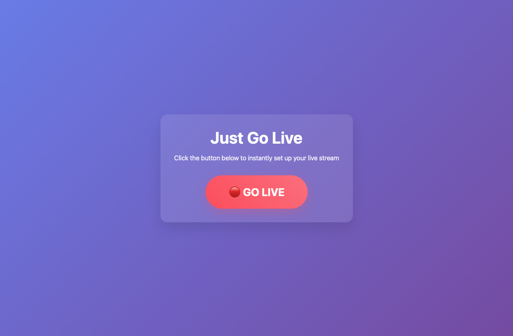
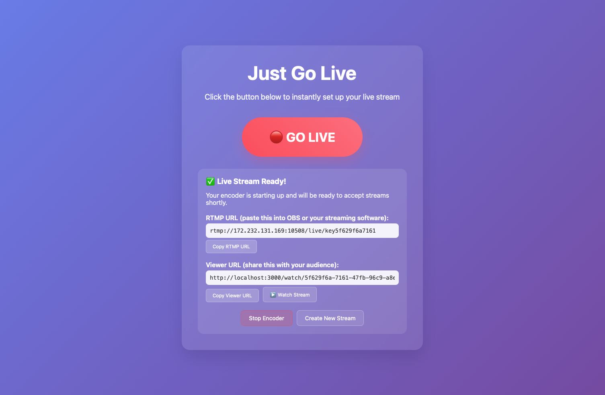

# Just Go Live

A simple web application for quick live broadcasting using Eyevinn Live Encoding in Open Source Cloud.

## 🚀 Available as a Service

**Just Go Live** is now available as a ready-to-use service in [Open Source Cloud](https://app.osaas.io/browse/eyevinn-just-go-live)! 

Deploy instantly without any setup - just click and start streaming. Perfect for quick live broadcasts, demos, or testing.

[**Launch Just Go Live on OSaaS →**](https://app.osaas.io/browse/eyevinn-just-go-live)

## Screenshots

### Main Interface

*One-click live stream setup with the big red "GO LIVE" button*

### Live Stream Setup Complete

*After pressing "GO LIVE" - shows RTMP URL for streaming software and viewer URL for sharing*

## Features

- **One-Click Live Setup**: Big red "GO LIVE" button that instantly creates a live encoding instance
- **RTMP URL Generation**: Get an RTMP URL to paste directly into OBS or any streaming software  
- **Viewer Page**: Dedicated viewing page with HLS video player for your audience
- **URL Copying**: Easy copy buttons for both RTMP and viewer URLs
- **Stream Controls**: Start/stop encoder controls
- **Real-time Status**: Live status indicators and automatic stream detection

## Prerequisites

1. **OSC Access Token**: You need an Eyevinn Open Source Cloud account and access token
2. **Node.js**: Version 14+ installed

## Setup

1. **Clone or download this application**

2. **Install dependencies**:
   ```bash
   npm install
   ```

3. **Set your OSC Access Token**:
   ```bash
   export OSC_ACCESS_TOKEN=your_token_here
   ```

4. **Start the application**:
   ```bash
   npm start
   ```

5. **Open your browser** to `http://localhost:3000`

## Docker Deployment

### Using Docker Compose (Recommended)

1. **Set your OSC Access Token**:
   ```bash
   export OSC_ACCESS_TOKEN=your_token_here
   ```

2. **Run with Docker Compose**:
   ```bash
   docker-compose up -d
   ```

3. **Open your browser** to `http://localhost:3000`

### Using Docker

1. **Build the image**:
   ```bash
   docker build -t just-go-live .
   ```

2. **Run the container**:
   ```bash
   docker run -d \
     --name just-go-live \
     -p 3000:3000 \
     -e OSC_ACCESS_TOKEN=your_token_here \
     -e PUBLIC_URL=http://your-domain.com:3000 \
     -v userdata:/userdata \
     just-go-live
   ```

3. **Open your browser** to `http://localhost:3000`

## How to Use

### For Streamers:

1. **Go to the main page** (`http://localhost:3000`)
2. **Click "GO LIVE"** - this creates a new live encoding instance in OSC
3. **Copy the RTMP URL** and paste it into your streaming software (OBS, etc.)
4. **Click "Start Encoder"** to begin accepting the stream
5. **Share the Viewer URL** with your audience

### For Viewers:

1. **Visit the viewer URL** shared by the streamer
2. **Watch the live stream** in the web player
3. **Real-time status** shows if the stream is live or offline

## Technical Details

- **Backend**: Node.js with Express
- **Frontend**: Vanilla HTML/CSS/JavaScript  
- **Video Player**: Video.js with HLS support
- **Live Encoding**: Eyevinn Live Encoding service on OSC
- **Stream Protocol**: RTMP input, HLS output

## API Endpoints

- `POST /api/go-live` - Create new live stream instance
- `POST /api/start-encoder/:streamId` - Start the encoder
- `POST /api/stop-encoder/:streamId` - Stop the encoder  
- `GET /api/stream/:streamId` - Playback information for a stream: `streamId`, `hlsUrl`, `status`
- `GET /watch/:streamId` - Viewer page for stream

The viewer link is public, and `GET /api/stream/:streamId` is the request the viewer
page makes, so it is reachable without authentication. Its response is built from a
fixed allowlist and must stay that way: the stream key, the ingest URL and any access
token belong to the broadcaster, not the audience. Do not return the stored stream
object from it.

## Environment Variables

- `OSC_ACCESS_TOKEN` - Your Eyevinn Open Source Cloud access token (required)
- `PORT` - Server port (default: 3000)
- `PUBLIC_URL` - Public URL for viewer links (optional, defaults to auto-detected host)
- `DATA_DIR` - Directory to store stream data (optional, defaults to application directory in development, `/userdata` in production)

## Stream URLs

- **RTMP Input**: `rtmp://IP:PORT/live/STREAMKEY`
- **HLS Output**: `https://instance-url/origin/hls/index.m3u8`
- **Viewer Page**: `http://localhost:3000/watch/STREAM_ID`

## Troubleshooting

1. **"OSC_ACCESS_TOKEN environment variable is required"**
   - Make sure you've exported your OSC access token

2. **"Failed to create instance"**
   - Check your OSC token is valid and you have access to Eyevinn Live Encoding service

3. **Stream not showing**
   - Ensure you've started the encoder before streaming
   - Check that your streaming software is configured with the correct RTMP URL

## Contributing

Contributions are welcome! Please feel free to submit a Pull Request.

## License

This project is licensed under the MIT License - see the [LICENSE](LICENSE) file for details.

Copyright (c) 2025 Eyevinn Technology AB

## About Eyevinn Technology

Eyevinn Technology is an independent consultant firm specialized in video and streaming. Independent in a way that we are not commercially tied to any platform or technology vendor.

At Eyevinn, every software developer consultant has a dedicated budget reserved for open source development and contribution to the open source community. This give us room for innovation, team building and personal competence development. And also gives us a way to contribute back to the open source community.

Want to know more about Eyevinn and how it is to work here? Contact us at work@eyevinn.se!